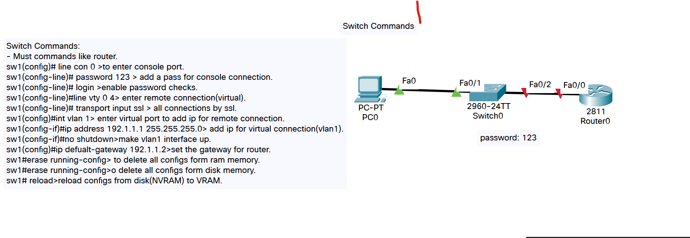

# CCNA Practice Labs
I studied this course with <a href="http://www.halmalki.net/" target="_blank">eng.Hussian Almalki</a>.

 `Here are a few tips to get you started:`

* In this **document** you will see  small description, capture and link for every **lab**.

* In labs you can see the structure and used commands.

Switch Commands
 [<a href="labs\SwitchCommands.pkt" target="_blank">The Lab</a>]

 

Photo From Lab

This is how you dropdown.

Router Commands
 [<a href="labs\RouterCommands.pkt" target="_blank">The Lab</a>]

 

Photo From Lab

This is how you dropdown.

